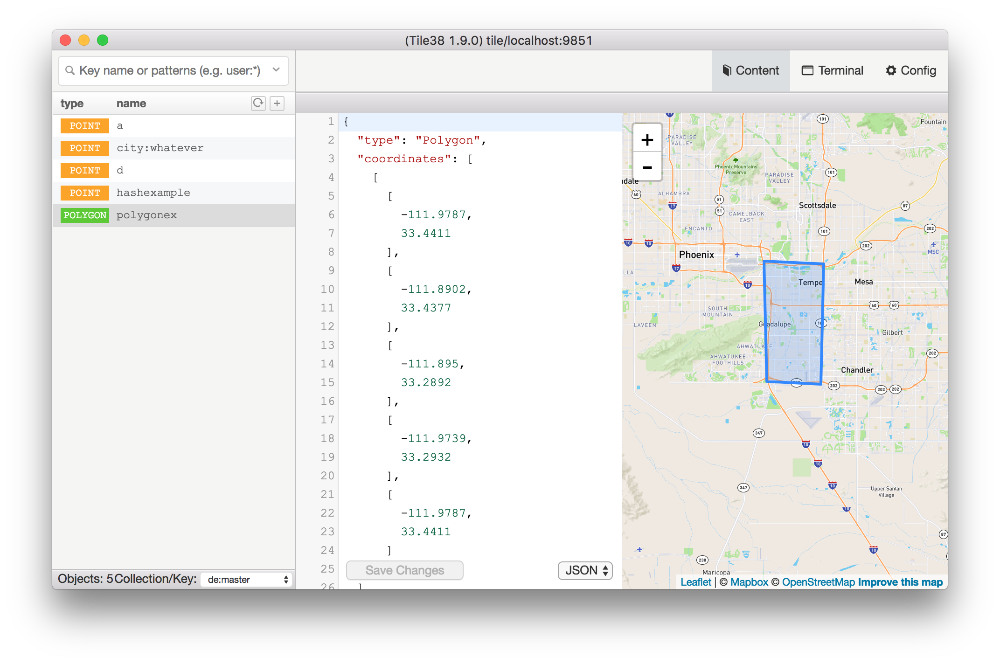

# Tedis



Tedis is a beautiful, easy-to-use [Tile38](http://tile38.com/) management application built on the modern web with [Electron](https://github.com/atom/electron), [React](https://facebook.github.io/react/), and [Redux](https://github.com/rackt/redux). It's powered by many awesome Node.js modules, especially [ioredis](https://github.com/luin/ioredis) and [ssh2](https://github.com/mscdex/ssh2).

It is a fork of [Medis](http://getmedis.com/), a UI for Redis. Since Tile38 supports the Redis RESP protocol, many of the features and core functionalities of Medis could be re-used and build upon. Many thanks to the original creators!

Tedis starts with all the basic features you need:

* Keys viewing/editing
* SSH Tunnel for connecting with remote servers
* Terminal for executing custom commands
* Config viewing/editing
* Visualizing GeoJSON on a rendered map canvas

It also supports many advanced features:

* Working with millions keys and key members without blocking the redis server
* Pattern manager for easy selecting a sub group of keys.

## Download Tedis

*Coming soon*

## Running Locally


```bash
# 1. Install dependencies
npm install

# 2. Compile assets
npm run build

# 3. Launch electron app
npm run electron
```

## License

MIT
